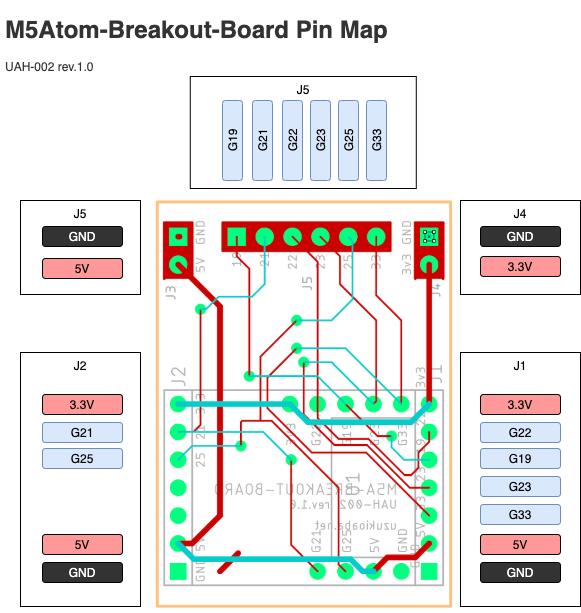
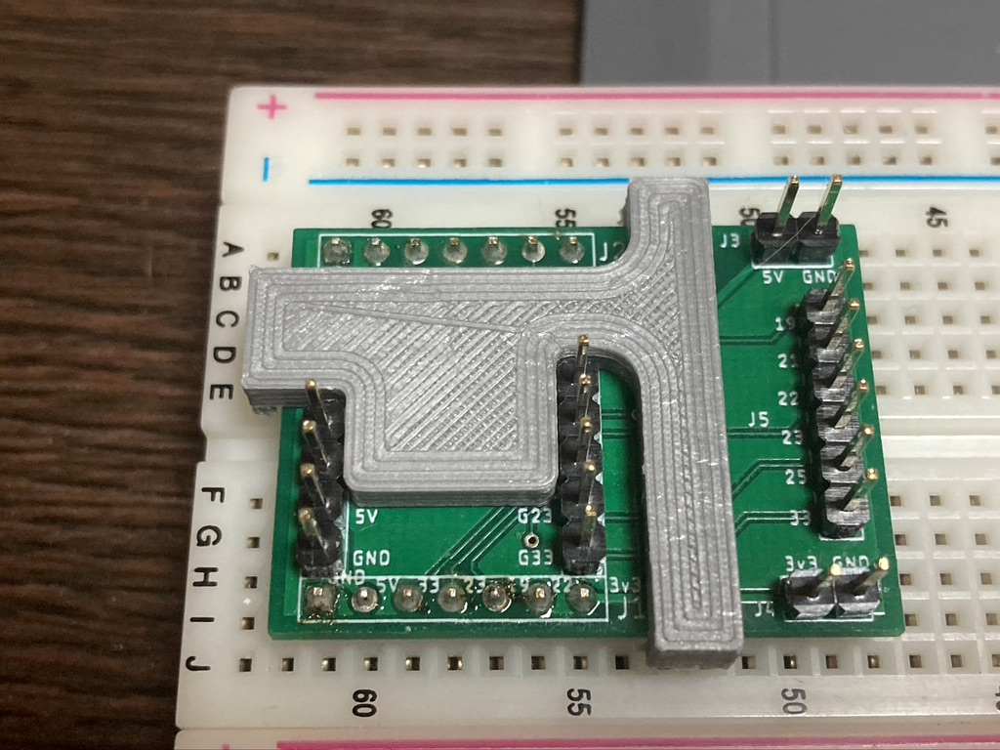

# Breakout Board for M5ATOM 取扱説明書

## Overview
このドキュメントは、Breaktout Board for M5ATOM(以下、本基板)の取り扱いに関する説明書です。

## 対応機種
本基板はM5Atomシリーズの以下の製品に対応しています。

- [ATOM Matrix](https://docs.m5stack.com/#/en/core/atom_matrix)
- [ATOM Lite](https://docs.m5stack.com/#/en/core/atom_lite)
- [ATOM Echo](https://docs.m5stack.com/#/en/atom/atomecho)

## ピン配置
本基板では、ATOMの背面のGPIOを以下のピンに配置しています。

- J1, J2 はブレッドボード使用時に横方向にジャンパを引き回す際に使用してください。
- J5 は直接ジャンパケーブルでGPIOを引き回す際に使用してください。
- J3, J4 はブレッドボードの電源ラインへ引き回すか、またはジャンパケーブルで電源を取り回す際に使用してください。

## 組立について
組み立て方は以下を参考にしてください。

1. ピンヘッダを実装してください。
   1. J1, J2 は下向きに、ATOM用(4Pin, 5Pin)とJ5は上向きに実装してください。
   2. J3, J4 は用途に合わせて上向きまたは下向きに実装してください。
2. U1(ATOM) の位置にスペーサーを設置します。
   1. 両面テープ等で適宜固定してください。

スペーサーの取り付け例  

